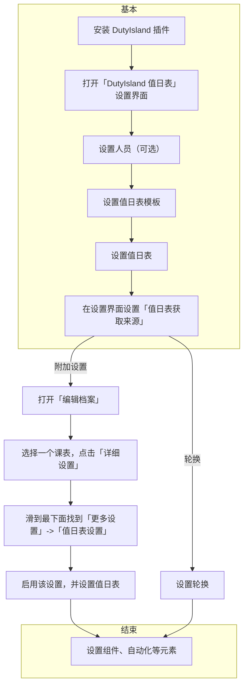

<div align="center">
  

# DutyIsland

[](https://wakatime.com/badge/github/lrsgzs/DutyIsland)

</div>

> 为 ClassIsland 添加个垃圾值日表（正在编写）

## 开发计划

- [x] 值日表编辑
- [x] 值日表加载
  - [x] 从课表加载
  - [x] 自动轮换
- [ ] 值日表展示
  - [x] 格式化字符串
  - [ ] 高级文本(较晚)
- [x] 值日提醒
  - [x] 通过行动提醒
  - [x] 自动提醒
  - [x] 支持“一键”提醒所有值日者
  - [x] 支持从托盘提醒
- [ ] 点名支持
  - [ ] 点名功能
  - [ ] 引荐 SecRandom
- [ ] 插件联动
  - [ ] SuperAutoIsland
    - [x] 积木
    - [ ] 数据提供 (等 sai 做出来)
  - [ ] ExtraIsland 值日迁移
  - [ ] 还未新建文件夹的 NextHoliday
- [ ] 垃圾事务
  - [ ] 换一个图标
- [ ] ...

## 如何使用

### Markdown 版本

#### 基本

1. 安装 DutyIsland 插件
2. 打开「DutyIsland 值日表」设置界面
3. 设置人员（可选）
4. 设置值日表模板
5. 设置值日表
6. 在设置界面设置「值日表获取来源」

#### 若选择「附加设置」

1. 打开「编辑档案」
2. 选择一个课表，点击「详细设置」
3. 滑到最下面找到「更多设置」->「值日表设置」
4. 启用该设置，并设置值日表

#### 若选择「轮换」

1. 设置轮换

#### 结束

1. 设置组件、自动化等元素，因为这些元素的下拉框内容是从当前活动的值日表读取的。

### Mermaid 版本



## 开放源代码许可协议
```
DutyIsland - add a duty plan feature to ClassIsland
Copyright (C) 2025  lrs2187/lrsgzs

This program is free software: you can redistribute it and/or modify
it under the terms of the GNU General Public License as published by
the Free Software Foundation, either version 3 of the License, or
(at your option) any later version.

This program is distributed in the hope that it will be useful,
but WITHOUT ANY WARRANTY; without even the implied warranty of
MERCHANTABILITY or FITNESS FOR A PARTICULAR PURPOSE.  See the
GNU General Public License for more details.

You should have received a copy of the GNU General Public License
along with this program.  If not, see <https://www.gnu.org/licenses/>.
```
